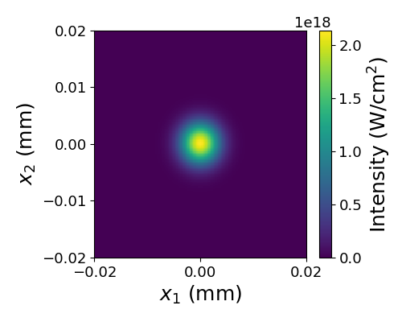

Running on the Desktop
======================

.. caution::

	This document assumes you have followed the installation instructions precisely.  Once installed, running SeaRay should be the same for any UNIX-based desktop system.

.. tip::

	You can issue UNIX like commands in Windows via the PowerShell.  Otherwise, use the Anaconda prompt and replace the forward slash with the backslash in directory paths.

OpenCL Background
-----------------

In order to run SeaRay, it is useful to understand a little about OpenCL. SeaRay uses a Python wrapper for OpenCL, called PyOpenCL, to accelerate certain computations.  OpenCL is designed to interface with arbitrary computing devices, especially multi-core CPU and general purpose GPU (GPGPU) devices.  For this reason the user is invited to specify a device to use for these accelerations.  This specification is optional, but if SeaRay tries to choose a device on its own, and that device turns out not to be appropriate, the run may fail.  The two failure modes most likely are (i) not enough memory on the device, and (ii) not enough floating point precision on the device.

Running a Ray Example
---------------------

	#. Activate your virtual environment (see :doc:`generic-install`)
	#. Pick some example from :samp:`{raysroot}/examples/eikonal/`.
	#. For definiteness, let us use :samp:`{raysroot}/examples/eikonal/parabola.py`
	#. Open a terminal window and navigate to :samp:`{raysroot}`
	#. :samp:`python rays.py list`
	#. The above command lists the hardware acceleration platforms and devices available on your system.  A device may be available only within a given platform.  If there is more than one platform, choose the one you would like to use, and pick out some unique part of its name, such as :samp:`{cuda}`.  Case does not matter.  Similarly, if there is more than one device, choose some unique part of its name, such as :samp:`{titan}`
	#. :samp:`python rays.py run file=examples/eikonal/parabola.py platform={cuda} device={titan}`
	#. This copies the :samp:`parabola.py` example file to the :samp:`{raysroot}` directory as :samp:`inputs.py` and runs the calculation.  If you do not specify a file, SeaRay will use whatever :samp:`inputs.py` is in :samp:`{raysroot}`.  It is best practice to never directly edit :samp:`inputs.py`.
	#. When the run is finished, you should have several output files in :samp:`{raysroot}/out`.  The output files are simply pickled numpy arrays.
	#. Let us plot the results using the SeaRay plotter.  The plotter is not interactive, but allows for a fairly high degree of control using command line options. You can get a help screen by executing :samp:`python ray_plotter.py` with no arguments.
	#. :samp:`python ray_plotter.py out/test o3d`
	#. You should see a 3D rendering of the ray orbits reflecting off an off-axis parabola, as in Fig. 1 below (assuming :samp:`matplotlib` environment).  When you are done looking close the plot window.
	#. :samp:`python ray_plotter.py out/test det=1,2/0,0/0.1`
	#. This should produce an image of the radiation intensity at the focal point, as in Fig. 2 below.

.. figure:: parabola.png
	:scale: 50 %

	Fig. 1 --- ray orbits from parabolic mirror example

	Fig. 2 --- Intensity at best focus

Running a Wave Example
----------------------

	#. Activate your virtual environment (see :doc:`generic-install`)
	#. Run the example case :samp:`{raysroot}/examples/paraxial/air-fil.py` following the same general procedure as above.
	#. Wave runs typically take longer, although this one is fairly quick.  You should see some text based progress indicators as the wave propagation is calculated.  The time stepper is adaptive, so varying amounts of work may be done between diagnostic planes.
	#. At present you must use the Jupyter-based interactive viewer to plot the results.  For the following Jupyter must be installed in your environment.
	#. :samp:`jupyter notebook`
	#. When the Jupyter home page comes up select :samp:`ray_viewer.ipynb`.
	#. For this example you should not need to change the source.  Generally, if output files are saved under a different location or name this has to be entered into the notebook source.
	#. Run the notebook.  Press the ``Autoscale All`` button, and then advance the z-slider to observe the pulse evolution.
	#. The plot may not always update as expected.  Changing the slider positions will generally force an update.

	Fig. 3 --- Interactive viewer with results from ``paraxial/air-fil.py`` example.
