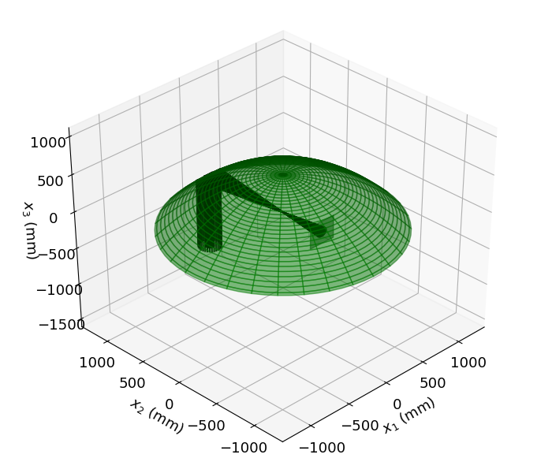

Running on the Desktop
======================

.. caution::
	This document assumes you have followed the installation instructions precisely.  Once installed, running SeaRay should be the same for any UNIX-based desktop system.

.. tip::

	If using Windows, remember to replace the forward slash with the backslash in directory paths, and to use the Anaconda prompt and not the DOS prompt.

OpenCL Background
-----------------

In order to run SeaRay, it is useful to understand a little about OpenCL. SeaRay uses a Python wrapper for OpenCL, called PyOpenCL, to accelerate certain computations.  OpenCL is designed to interface with arbitrary computing devices, especially multi-core CPU and general purpose GPU (GPGPU) devices.  For this reason the user is invited to specify a device to use for these accelerations.  This specification is optional, but if SeaRay tries to choose a device on its own, and that device turns out not to be appropriate, the run may fail.  The two failure modes most likely are (i) not enough memory on the device, and (ii) not enough floating point precision on the device.

Running an Example
------------------

	#. Activate your virtual environment (see :doc:`generic-install`)
	#. Pick some example from :samp:`{raysroot}/examples`.
	#. For definiteness, let us use :samp:`{raysroot}/examples/parabola.py`
	#. Open a terminal window and navigate to :samp:`{raysroot}`
	#. :samp:`cp examples/parabola.py inputs.py`
	#. This puts the input file in :samp:`{raysroot}` with the name :samp:`inputs.py`.  SeaRay always expects the input file to have the name :samp:`inputs.py`, and to be in the working directory.
	#. :samp:`python rays.py list`
	#. The above command lists the hardware acceleration platforms and devices available on your system.  Most often you need not worry about the platform since there will typically be only one. If there is more than one device, choose the one you would like to use, and pick out some unique part of its name, such as :samp:`{xeon}`.  Case does not matter.
	#. :samp:`python rays.py run device={xeon}`
	#. When the run is finished, you should have several output files in :samp:`{raysroot}/out`.  The output files are simply pickled numpy arrays.
	#. Let us plot the results using the SeaRay plotter.  The plotter is not interactive, but allows for a fairly high degree of control using command line options. You can get a help screen by executing :samp:`python ray_plotter.py` with no arguments.
	#. :samp:`python ray_plotter.py out/test o3d`
	#. You should see a 3D rendering of the ray orbits reflecting off an off-axis parabola, as in Fig. 1 below (assuming :samp:`matplotlib` environment).  When you are done looking close the plot window.
	#. :samp:`python ray_plotter.py out/test det`
	#. This should produce an image of the radiation intensity 1 mm upstream of the focal point and exactly at the focal point, as in Fig. 2 below.

	Fig. 1 --- ray orbits from parabolic mirror example

.. figure:: parabola-spots.png
	:scale: 50 %

	Fig. 2 --- Intensity in eikonal plane and at best focus
